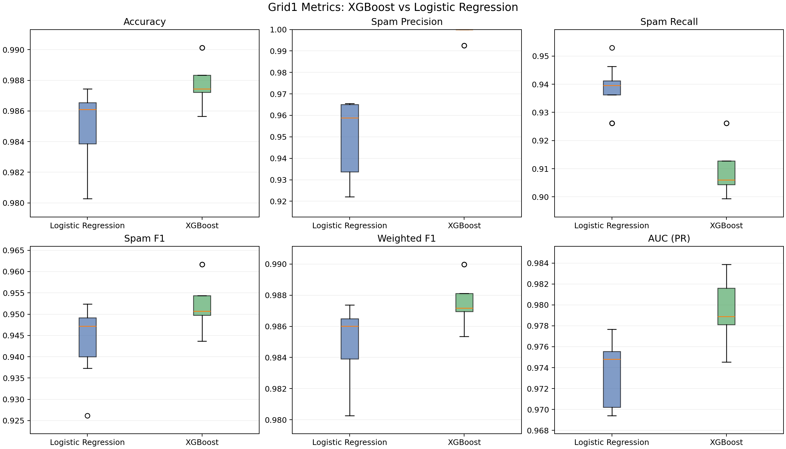

# SMS Spam Collection Classifier

Binary SMS classification project on the Kaggle SMS Spam Collection dataset, comparing `logistic_regression` and `xgboost` across multiple preprocessing and vectorization settings.

## Dataset

- Source: [Kaggle - SMS Spam Collection Dataset](https://www.kaggle.com/datasets/uciml/sms-spam-collection-dataset)
- Samples: 5,574 English SMS messages
- Target labels: `ham`, `spam`

## What this project tests

- Text preprocessing modes: `none`, `lemmatize`, `stem`, `lemma_then_stem`
- Sparse vectorization modes: `tfidf_word_char`, `count_word_char`, `tfidf_plus_count`
- Shared dense engineered SMS features for all model runs
- Two model families: `logistic_regression` and `xgboost`

## Repository layout

- `src/data.py` - dataset loading and path resolution
- `src/preprocessing.py` - text normalization and morphology pipeline
- `src/features.py` - handcrafted dense anti-spam features
- `src/vectorizers.py` - sparse vectorizer builders
- `src/modeling.py` - estimator factory and training pipeline
- `src/train.py` - train a single configured run and save artifacts
- `src/evaluate.py` - evaluate model outputs and threshold behavior
- `src/sweep.py` - run full preprocessing/vectorizer/model grid sweeps
- `src/plot_grid1_boxplots.py` - plots model comparison charts from saved metrics
- `tests/` - regression and smoke tests

## Quickstart

Install dependencies:

```bash
python -m venv .venv
source .venv/bin/activate
pip install -r requirements.txt
```

Run training:

```bash
PYTHONPATH=src .venv/bin/python src/train.py
```

Run evaluation:

```bash
PYTHONPATH=src .venv/bin/python src/evaluate.py
```

Run tests:

```bash
PYTHONPATH=src .venv/bin/python -m pytest -q
```

Useful Make targets:

```bash
make help
make install
make train
make eval
make test
make baseline
make sweep-all-combinations
make clean-artifacts
make clean-reports
```

Common parameterized examples:

```bash
make train OUTPUT_DIR=artifacts/count_stem VECTORIZER_MODE=count_word_char PREPROCESSING_MODE=stem
make sweep-all-combinations OUTPUT_DIR=artifacts/grid1
make eval OUTPUT_DIR=artifacts/grid1 MODEL_NAME=xgboost PREPROCESSING_MODE=stem VECTORIZER_MODE=tfidf_word_char
```

## Artifacts and reports

Typical outputs written by training/evaluation workflows:

- `artifacts/<run>/model.joblib`
- `artifacts/<run>/config.json`
- `artifacts/<run>/metrics.json`
- `artifacts/<run>/confusion_matrix.csv`
- `artifacts/<run>/threshold_report.csv`
- `artifacts/<run>/threshold_recommendation.json`
- `reports/baseline/baseline_metrics.json`

## Results

`grid1` runs compare both model families over the same preprocessing and vectorizer grid.



Key outcomes from `artifacts/grid1/metrics.json`:

- Best `xgboost` run: accuracy `0.9901`, spam precision `1.0000`, spam recall `0.9262`, spam F1 `0.9617`.
- Best `logistic_regression` run: accuracy `0.9874`, spam precision `0.9655`, spam recall `0.9396`, spam F1 `0.9524`.
- Across the grid, `xgboost` is consistently stronger on precision and overall F1/accuracy, while `logistic_regression` tends to recover slightly more spam (higher recall in its top runs).

## Conclusion

`xgboost` is the strongest overall choice in this project because it delivers the highest aggregate classification performance and near-zero false positives. `logistic_regression` remains competitive and can be preferred when marginally higher spam recall is more important than maximum precision.
